# `transfer` Command — Internal Flow (ASCII Chart)
<!-- updated: 2026-06-09_21:35:54 -->

How `sonar-migration-tool transfer` works end-to-end, traced from
[cmd/transfer.go](../go/cmd/transfer.go) down through `extract` → `structure` →
`mappings` → `migrate` → report emission. Verified by a 4-agent parallel trace
of the real call graph (workflow run `wf_471cf8cf-f9c`, 2026-06-09).

**Reading the chart:** `=>` data-on-disk handoff (JSONL/CSV); `->` in-process
call; `[N/4]` is the user-facing phase banner; boxes are package boundaries.
The whole command is bookended by a single deferred
`common.LogCommandDuration(slog, "transfer", t0)` registered as the first
statement of `runTransfer`.

```
================================================================================

   sonar-migration-tool transfer            cmd/transfer.go : runTransfer (L344)

   defer LogCommandDuration("transfer", t0)   <-- fires LAST, bookends everything

================================================================================
        |
        v

   resolveTransferConfig(cmd)          merge --config file + CLI flags (flags win)
   |
   |    loadTransferFileDefaults --> extract.LoadExtractConfigFile  (source.*)
   |                                 migrate.LoadMigrateConfigFile   (target.*)
   |                                 loadTransferOverlay             (project_key)
   |
   |    one-way skip flags:  --skip_issue_sync  /  --skip_project_data_migration
   |
   |    enterprise_key  defaults to  default_organization
   |    exportDir       default      ./migration-files/
        |
        v

   validateTransferConfig(cfg)         source  url + token   required
                                       target  token + org   required
        |
        v

+==============================================================================+
|                                                                              |
|   [1/4]  EXTRACT     extract.RunExtract  (internal/extract/extract.go)       |
|                                                                              |
|   pull SonarQube Server  ->  JSONL files on disk                             |
|                                                                              |
+==============================================================================+
        |
        v

   projectKey != ""  ?  ProjectKeys=[key]  :  nil (= all)
   IncludeProjectData = !skipProjectDataMigration
        |
        +-- applyDefaults:  concurrency=25, timeout=60, exportType="all"
        |
        +-- initClient
        |       ->  GET api/server/version          (detectVersion -> common.Version)
        |       ->  GET api/system/info  --|403|-->  api/navigation/global
        |                                            (detectEdition)
        |
        +-- prepareExtractDir  ->  mkdir exportDir/<runID>/   (runID = date-NN, max+1)
        |
        +-- buildPlan:  RegisterAll -> Registry -> FilterByEdition(edition)
        |       targets = ALL "get*" tasks   (minus 6 projectData tasks if skip)
        |       ResolveDependencies -> PlanPhases (Kahn topo-sort -> [][]string)
        |
        +-- writeMetadataFile                                   => extract.json
        |
        +-- NewDataStore + filterCompleted   (skip task dirs that already exist)
        |
        +-- newExecutor  (Sem = chan struct{}, cap=concurrency; .ProjectKeys set)
        |
        v

   executePhases  (strictly ordered)  ->  runPhase (errgroup, limit = cap Sem)
        |
        v
  +----------------------------------------------------------------------------+
  |                                                                            |
  | P1   getProjects   GET api/projects/search?projects=<keys>   <== SCOPING   |
  |                                                 => getProjects/*.jsonl     |
  |                                                                            |
  |       every later per-project task ReadAll "getProjects" from disk         |
  |                                                                            |
  | per-project   (forEachDep, 1 goroutine / proj, sem-bounded):               |
  |                                                                            |
  |       getProjectSettings / Links / Measures / Webhooks / Bindings /        |
  |       Details / Tags / GroupsPermissions / UsersScanners                   |
  |                                          => <task>/*.jsonl                 |
  |                                                                            |
  |       403 / 404  ->  RecordSkipped(key)  ->  dropped from all later tasks  |
  |                                                                            |
  | project-data   (IF IncludeProjectData)   forEachProjectBranch:             |
  |                                                                            |
  |       getProjects x getBranches  (drop type==SHORT, branches sequential)   |
  |       getProjectIssuesFull / HotspotsFull / ComponentTree / Versions       |
  |       ComponentTree => getProjectSourceCode + getProjectSCMData (per file) |
  |       hotspots enriched via api/hotspots/show  (rule.key -> ruleKey)       |
  |       version-gate: statuses vs issueStatuses @ SQ 10.4                    |
  |                                          => <task>/*.jsonl                 |
  |                                                                            |
  +----------------------------------------------------------------------------+
        |
        | MarkComplete each task after its phase  (any task error aborts extract)
        v

   return SkippedProjectKeys()  ->  warnSkippedProjects (stderr, NON-fatal)
        |
        v

+==============================================================================+
|                                                                              |
|   [2/4]  STRUCTURE   structure.RunStructure  (internal/structure)            |
|                                                                              |
|   pure local JSON  ->  CSV     ;     NO API calls                            |
|                                                                              |
+==============================================================================+
        |
        v

   GetUniqueExtracts(exportDir)        <= reads <id>/extract.json (url field)
   |                                      serverURL -> newest extractID
        |
        v

   MapProjectStructure   <= getNewCodePeriods, getBindings, getProjectBindings,
   |                         getProjectDetails (*.jsonl)  -> []Binding, []Project
   |
   |    blank branch -> master ;  REFERENCE_BRANCH / SPECIFIC_ANALYSIS dropped
        |
        v

   MapOrganizationStructure(bindings, cfg.defaultOrganization)   <== KEY STEP
   |
   |    sonarcloud_org_key = defaultOrganization  for EVERY row (pre-filled)
        |
        v

   ExportCSV       => organizations.csv   (sc_org_key filled)
                   => projects.csv
        |
        v   (sequential — mappings needs projects.csv)

+==============================================================================+
|                                                                              |
|   [3/4]  MAPPINGS    structure.RunMappings  (no defaultOrganization)         |
|                                                                              |
+==============================================================================+
        |
        v

   GetUniqueExtracts(exportDir)
   LoadCSV(projects.csv) -> projectOrgMapping  (server_url+key -> sonarqube_org)
        |
        v   (Go data-dependency order, NOT randomized map order)

   MapTemplates ---+
   MapProfiles  ---+--> feed --> MapGroups   (consumes profiles[] + templates[])
   MapGates        |
   MapPortfolios   |   (deduped by SHA-256 of sorted project composition)
        |
        v

   ExportCSV  x5   => templates.csv  /  profiles.csv  /  gates.csv  /
                      portfolios.csv /  groups.csv
        |
        v

+==============================================================================+
|                                                                              |
|   [4/4]  MIGRATE     migrate.RunMigrate  (internal/migrate/migrate.go)       |
|                                                                              |
|   TargetTasks = transferTargetTasks  (14 project-scoped leaves)              |
|   DefaultOrganization left UNSET  (structure already stamped sc_org_key)     |
|                                                                              |
+==============================================================================+
        |
        v

   applyDefaults  (concurrency=25, url=sonarcloud.io, edition=enterprise)
   applyOrgMapping  ->  validateOrgsExist
        |
        |    build 2 Cloud clients:
        |        cloudClient @ sonarcloud.io
        |        apiClient   @ api.sonarcloud.io
        |        (+ WithRetryLogger + WithRateLimitObserver -> RateLimitTracker.Observe)
        |
        |    runID = generateRunID(dir) = "YYYY-MM-DD-NN", NN = maxN+1 (gap-safe #361)
        |    RegisterAll -> BuildMigrateRegistry -> FilterByEdition
        |    if SkipProjectDataMigration: force SkipIssueSync=true
        |
        v

   MigrateTargetTasks:  TargetTasks non-empty -> return the 14 leaves AS-IS,
   |                    minus skip-gated tasks (importPD / sync* if skipped)
        |
        v

   ResolveDependencies  (DFS transitive closure)            ->  ~25-task set
   PlanPhases  (Kahn topo-sort, alphabetical within phase)  ->  6 phases
        |
        v

   writeMigrateMeta  => plan.json
   filterCompleted   (resume: skip existing dirs)
        |
        v   for each phase: runPhase (errgroup, 1 goroutine PER TASK, no limit)
  +----------------------------- THE 6-PHASE DAG ------------------------------+
  |                                                                            |
  | P1   generate{Project,Profile,Gate,Group,Organization}Mappings   (no deps) |
  |         |                                                                  |
  | P2   createProjects, createProfiles, createGates, createGroups,            |
  |       getMigrationUser                                                     |
  |         |                                                                  |
  | P3   analyzeProfileRules, getGateConditions, getProfileBackups,            |
  |       grantMigrationUserProjectPermissions, setProfileParent               |
  |         |                                                                  |
  | P4   restoreProfiles, addGateConditions     <== profiles + gate configured |
  |       setProjectProfiles / Gates / GroupPermissions / Settings /           |
  |         Tags / Links / Webhooks, setNewCodePeriods  BEFORE scan replay (P5)|
  |         |                                                                  |
  | P5   importProjectData                                                     |
  |         |                                                                  |
  |       per-project fan-out  (g.SetLimit = cap Sem):                         |
  |         |                                                                  |
  |         collectBranchInfo (LONG only) -> sortBranchesMainFirst             |
  |           -> filterBranches(ExcludeBranches globs; main never excluded)    |
  |         |                                                                  |
  |         MAIN branch first = BLOCKING GATE  (fail -> non-main "skipped")    |
  |         |                                                                  |
  |         non-main branches SEQUENTIAL:                                      |
  |           buildBranchReport: load issues / hotspots / components /         |
  |             sources / activeRules ;  skip empty/purged ;                   |
  |             remap SQ->SC profile keys ;  dedup active rules ;              |
  |             drop issues on inactive rules ;                                |
  |             BackdateChangesets -> original creation dates                  |
  |         |                                                                  |
  |           non-main: PreCreateAnalysis POST {api}/analysis/analyses         |
  |             -> analysisUuid stamped into metadata field 19,                |
  |                BranchType="long", reference=MAIN (field 11)                |
  |         |                                                                  |
  |           scanreport.PackageReport (ZIP/Deflate) -> SubmitReport           |
  |             -> /api/ce/submit -> PollCETask        => importProjectData/*  |
  |         |                                                                  |
  | P6   syncIssueMetadata || syncHotspotMetadata  (concurrent; dep importPD)  |
  |         |                                                                  |
  |       forEachMigrateItem(createProjects):                                  |
  |         loadMatchable* (issues: exclude CLOSED/FIXED; hotspots: REVIEWED)  |
  |         actionable filter (manual changes / comments)                      |
  |         waitForCloudIndexing (exp backoff, non-fatal)                      |
  |         runProjectSyncLoop (cap Sem):                                      |
  |           ISSUES:   search componentKeys=key:file & rules=rule &           |
  |             issueStatuses=...  -> classify by line                         |
  |             (1=sync, 0=miss, >1=ambig)                                     |
  |             -> transition -> comments -> tags (+metadataSyncTag idem)      |
  |           HOTSPOTS: search projectKey & files  (NO rules param)            |
  |             -> classify by (ruleKey, line) -> ChangeStatus -> comments     |
  |                                              => sync*Metadata/*.jsonl      |
  |                                                                            |
  +----------------------------------------------------------------------------+
        |
        | deferred (every exit):  run_meta.json, run_events.jsonl,
        |                         rate_limit_events.json
        v

   return runID   (returned even on phase error, so reports still emit)
        |
        v

+==============================================================================+
|                                                                              |
|   REPORTS            emitReports  ->  summary.GenerateReports                |
|                                                                              |
|   fire-and-forget: report failure NEVER fails the transfer                   |
|                                                                              |
+==============================================================================+
        |
        v

   runDir = exportDir/<runID>
   summary.GenerateReports(runDir, outputDir=exportDir, exportDir)
        |
        +-- CollectSummary(runDir, exportDir)   <= task JSONL + requests.log +
        |       run_meta.json + extract JSONL  -> *MigrationSummary (single pass)
        |
        +-- RenderPDF       -> os.WriteFile  => <exportDir>/migration_summary.pdf
        |
        +-- RenderMarkdown  -> os.WriteFile  => <exportDir>/migration_summary.md
        |
        v

   println "Transfer complete."
        |
        v

   (defer fires)  LogCommandDuration  ->  "Command transfer" total wall-time line
================================================================================
```

## Same flow as a Mermaid chart
<!-- updated: 2026-06-09_21:45:00 -->

Top-to-bottom render of the identical flow, with plain-English descriptions on
every step so anyone can follow along. Orange cylinders are files saved to disk.
Solid arrows are in-process calls. Dashed arrows are disk reads or writes.
Each coloured box is a phase or package boundary.

```mermaid
flowchart TB
    classDef disk fill:#fff7e6,stroke:#c8881b,color:#5b3d00;
    classDef gate fill:#ffe9e9,stroke:#c0392b,stroke-width:1.5px;

    START(["🚀 sonar-migration-tool transfer<br/><i>You typed this command. It starts the whole migration process.<br/>Everything below is what happens automatically from here.</i>"])

    DUR[/"⏱️ Start a hidden stopwatch<br/><i>A timer is secretly started in the background right now.<br/>It will print the total time the command took when everything finishes.</i>"/]

    CFG["⚙️ Read your configuration<br/><i>The tool reads your config file and any extra flags you typed on the command line.<br/>Flags you typed win over anything in the file.<br/>It figures out: which SonarQube Server to copy FROM, which SonarCloud to copy TO,<br/>which project to move, and whether to skip issues or project data.</i>"]

    VAL{"✅ Check the config is complete<br/><i>Before doing anything real, the tool checks it has everything it needs.<br/>Source: needs a server URL and an access token.<br/>Target: needs a SonarCloud token and an organisation name.<br/>If anything is missing it stops here with an error.</i>"}

    START --> DUR --> CFG --> VAL

    %% ===================== [1/4] EXTRACT =====================
    subgraph EX["📥 STEP 1 of 4 — EXTRACT   (copies data from SonarQube Server to files on your disk)"]
        direction TB

        EX_INIT["🔌 Connect to SonarQube Server<br/><i>The tool pings the server to find out its version number and which edition it is<br/>(Community, Developer, Enterprise…). This decides which features are available<br/>and which data tasks to run.</i>"]

        EX_PLAN["📋 Build a task plan<br/><i>The tool looks up every possible data type it knows how to export,<br/>filters out the ones not supported by this server edition,<br/>then sorts them in the right order so nothing is fetched before its dependency.<br/>Result: an ordered list of download jobs.</i>"]

        EX_EXEC["▶️ Run all download jobs in order<br/><i>Jobs in the same 'phase' run in parallel to save time.<br/>Jobs in later phases only start once all earlier ones are done.<br/>Up to 25 jobs run at the same time (configurable with --concurrency).</i>"]

        EX_P1["🔍 Fetch the project list — SCOPING<br/><i>Ask the server: 'give me the projects I should migrate'.<br/>If you named a specific project key, only that one comes back.<br/>Every other download job reads this list to know which projects to process —<br/>this is the single source of truth for project scope.</i>"]

        EX_PP["📦 Download per-project metadata (runs for every project in parallel)<br/><i>For each project, download all the configuration details:<br/>settings, links, quality metrics, webhooks, DevOps bindings, tags,<br/>group permissions, and scanner user permissions.<br/>If the server says 'access denied' or 'not found' for a project,<br/>that project is recorded as skipped and quietly dropped from all later steps.</i>"]

        EX_PD["🐛 Download per-project issue data (the big download)<br/><i>For each branch of each project (skipping short-lived feature branches),<br/>download every bug, vulnerability, code smell, security hotspot,<br/>file tree, source code, and git blame history.<br/>Also grabs the full history of analysis versions.<br/>On newer SonarQube versions (10.4+) the field names for issue status are different —<br/>the tool handles both automatically.</i>"]

        EX_INIT --> EX_PLAN --> EX_EXEC --> EX_P1 --> EX_PP --> EX_PD
    end

    VAL --> EX_INIT
    EX_PD --> SKIP["⚠️ Log skipped projects and move on<br/><i>If any projects were inaccessible, print a warning to the terminal.<br/>This is non-fatal — the migration continues with whatever projects were reachable.</i>"]

    EXJSON[("📄 extract.json<br/><i>Records which server was used<br/>and when the extract ran.</i>")]:::disk
    GPJSON[("📄 getProjects/*.jsonl<br/><i>The downloaded project list.<br/>Every later step reads this file<br/>to know which projects exist.</i>")]:::disk
    TASKJSON[("📄 task-name/*.jsonl<br/><i>One folder per data type.<br/>All downloaded metadata and<br/>issue data lives here.</i>")]:::disk

    EX_PLAN -. "saves job plan" .-> EXJSON
    EX_P1 -. "saves project list" .-> GPJSON
    EX_PP -. "saves metadata" .-> TASKJSON
    EX_PD -. "saves issues + code" .-> TASKJSON
    GPJSON -. "re-read by every per-project job" .-> EX_PP

    %% ===================== [2/4] STRUCTURE =====================
    subgraph ST["🗂️ STEP 2 of 4 — STRUCTURE   (reorganises the downloaded data into CSV tables — no internet needed)"]
        direction TB

        ST_GET["📂 Find the latest extract folder<br/><i>Looks inside your migration-files folder to find the most recent download,<br/>identified by the server URL recorded in extract.json.</i>"]

        ST_MAP["🗺️ Build project &amp; branch table<br/><i>Reads the downloaded project details and figures out:<br/>which branches exist, what the 'new code' period is,<br/>and which DevOps repository each project is bound to.<br/>Drops unsupported branch types (reference branches, specific-analysis branches).<br/>A blank branch name is normalised to 'master'.</i>"]

        ST_ORG["🏢 Stamp the target organisation on every row — KEY STEP<br/><i>Every project row gets the SonarCloud organisation key filled in.<br/>This happens here once so the migrate step never has to look it up again.<br/>This is why you pass --default_organization when running transfer.</i>"]

        ST_CSV["💾 Write the CSV files<br/><i>Saves the organised data as two spreadsheet-style files:<br/>organizations.csv and projects.csv.<br/>These become the input for all remaining steps.</i>"]

        ST_GET --> ST_MAP --> ST_ORG --> ST_CSV
    end

    SKIP --> ST_GET
    EXJSON -. "read to find extract folder" .-> ST_GET
    ORGCSV[("📄 organizations.csv<br/><i>One row per organisation,<br/>with the SonarCloud org key<br/>already filled in.</i>")]:::disk
    PROJCSV[("📄 projects.csv<br/><i>One row per project+branch,<br/>with all mapping details.</i>")]:::disk
    ST_CSV -. "writes" .-> ORGCSV
    ST_CSV -. "writes" .-> PROJCSV

    %% ===================== [3/4] MAPPINGS =====================
    subgraph MP["🔗 STEP 3 of 4 — MAPPINGS   (translates server config objects into SonarCloud equivalents — no internet needed)"]
        direction TB

        MP_LOAD["📖 Load the project table<br/><i>Reads projects.csv to build a lookup of<br/>'server URL + project key → target organisation'.<br/>This tells later tasks which org each project belongs to.</i>"]

        MP_T["📝 Map quality profile templates<br/><i>Quality profile templates define default coding rules for new projects.<br/>Translates each server template into the equivalent SonarCloud format.</i>"]

        MP_P["🎯 Map quality profiles<br/><i>Quality profiles are the sets of coding rules used to analyse your code.<br/>Each profile on the server gets translated into the SonarCloud format,<br/>including its parent profile and all its rule customisations.</i>"]

        MP_G["🚦 Map quality gates<br/><i>Quality gates are the pass/fail thresholds (e.g. 'coverage must be &gt; 80%').<br/>Each gate and its conditions gets translated for SonarCloud.</i>"]

        MP_PF["📁 Map portfolios<br/><i>Portfolios are dashboards that group multiple projects together.<br/>Identical portfolios (same set of projects) are deduplicated using a hash<br/>so you don't end up with duplicate dashboards on SonarCloud.</i>"]

        MP_GR["👥 Map user groups<br/><i>User groups control who has access to what.<br/>Groups are built after profiles and templates because group permissions<br/>can reference those objects.</i>"]

        MP_CSV["💾 Write all mapping CSV files<br/><i>Saves five spreadsheet files: templates, profiles, gates, portfolios, groups.<br/>The migrate step reads these to know exactly what to create on SonarCloud.</i>"]

        MP_LOAD --> MP_T --> MP_GR
        MP_LOAD --> MP_P --> MP_GR
        MP_LOAD --> MP_G
        MP_LOAD --> MP_PF
        MP_GR --> MP_CSV
        MP_G --> MP_CSV
        MP_PF --> MP_CSV
    end

    PROJCSV -. "read" .-> MP_LOAD
    MAPCSV[("📄 templates / profiles / gates /<br/>portfolios / groups .csv<br/><i>Translation tables: server objects<br/>→ SonarCloud equivalents.</i>")]:::disk
    MP_CSV -. "writes" .-> MAPCSV

    %% ===================== [4/4] MIGRATE =====================
    subgraph MG["☁️ STEP 4 of 4 — MIGRATE   (creates everything on SonarCloud using the CSV tables as instructions)"]
        direction TB

        MG_INIT["🔧 Set up and connect<br/><i>Applies default settings (concurrency=25, target=sonarcloud.io, enterprise edition).<br/>Checks that every target organisation in the CSV files actually exists on SonarCloud.<br/>Opens two API connections: one to the main SonarCloud website,<br/>one to its separate API subdomain (needed for scan report uploads).<br/>Assigns a unique run ID like '2026-06-09-01' so results are easy to find later.<br/>If you said to skip project data, issue sync is also automatically skipped.</i>"]

        MG_RES["📐 Plan the migration tasks<br/><i>Figures out all the tasks needed to migrate the 14 project-level items.<br/>Traces every dependency (e.g. 'set project profile' needs 'create profile' first)<br/>to build a complete set of ~25 tasks.<br/>Sorts them into 6 ordered phases using a topological sort algorithm.<br/>Saves the plan to plan.json so a crashed run can be resumed later.</i>"]

        subgraph DAG["🔄 The 6-phase migration sequence (each phase only starts when the previous one fully completes)"]
            direction TB

            P1["Phase 1 — Generate ID mapping tables<br/><i>Before touching SonarCloud, figures out how to translate every object ID<br/>(project keys, profile names, gate names, group names, org keys)<br/>from the server format to the SonarCloud format.<br/>Nothing is created yet — this is just a translation dictionary.<br/>All five mapping jobs run in parallel.</i>"]

            P2["Phase 2 — Create the empty containers<br/><i>Actually creates objects on SonarCloud for the first time:<br/>new projects (empty shells), quality profiles, quality gates, and user groups.<br/>Also identifies the migration service account that will be used to make API calls.</i>"]

            P3["Phase 3 — Read back what was just created<br/><i>Fetches details about the objects created in Phase 2:<br/>the exact rules in each quality profile, the conditions in each gate,<br/>and a backup of each profile in case restore fails.<br/>Also grants the migration user access to the new projects,<br/>and sets parent-child relationships between profiles.</i>"]

            P4["Phase 4 — Configure all project settings<br/><i>Everything that needs to be configured BEFORE code analysis runs:<br/>restore full rule sets into quality profiles,<br/>add all conditions to quality gates,<br/>assign each project its quality profile and gate,<br/>set group permissions, project settings, tags, links, webhooks,<br/>and the 'new code' period definition.<br/>Must finish completely before Phase 5, because the scan replay reads these settings.</i>"]

            P5["Phase 5 — Replay all code analysis history<br/><i>The most complex step. For each project, re-uploads every historical analysis.<br/>Only LONG-lived branches are replicated (main + release branches — not feature branches).<br/>Main branch is always processed first and must succeed before non-main branches start.<br/>For each branch: assembles a package of all issues, hotspots, file contents,<br/>and git blame data; preserves the original creation timestamps of every finding;<br/>translates profile keys from server format to SonarCloud format;<br/>removes duplicate rules and any issues that reference deleted rules.<br/>For non-main branches: first registers the branch with SonarCloud<br/>so it knows this is a long-lived branch tied to main<br/>(without this registration step, SonarCloud would silently discard the data).<br/>Then uploads the compressed report package and waits for SonarCloud to process it.</i>"]

            MAINGATE{{"🚧 Main-branch checkpoint<br/><i>The main branch MUST import successfully.<br/>If it fails, all other branches for that project<br/>are marked as skipped. This prevents orphaned<br/>non-main branches with no parent.</i>"}}:::gate

            P6["Phase 6 — Sync issue metadata (runs in parallel for issues and hotspots)<br/><i>The scan replay in Phase 5 recreated the findings, but lost some human-added metadata:<br/>status changes, comments, tags, and assignments that were manually added on the server.<br/>This phase re-applies all of that.<br/>For each project: loads the original manual changes from disk, waits for SonarCloud<br/>to finish indexing the new findings (with automatic retries), then matches each<br/>old finding to its new equivalent by file path + line number.<br/>Issues: matched 1-to-1 → apply status transition, comments, tags.<br/>Hotspots: matched by rule + line → apply review status, comments.<br/>Ambiguous matches (multiple findings on same line) are flagged but not force-applied.</i>"]

            P1 --> P2 --> P3 --> P4 --> P5
            P5 --> MAINGATE --> P6
        end

        MG_INIT --> MG_RES --> P1
    end

    MAPCSV -. "read by migrate" .-> MG_INIT
    PROJCSV -. "read by migrate" .-> MG_INIT
    TASKJSON -. "issue + code data replayed in Phase 5" .-> P5

    PLANJSON[("📄 plan.json<br/><i>The migration task plan.<br/>Allows a failed run to<br/>resume where it left off.</i>")]:::disk
    IMPORTED[("📄 importProjectData/*<br/><i>Results of each scan report<br/>upload: CE task IDs and<br/>final statuses.</i>")]:::disk
    SYNCED[("📄 sync*Metadata/*.jsonl<br/><i>Records of every issue and<br/>hotspot metadata sync:<br/>what matched, what was applied.</i>")]:::disk

    MG_RES -. "saves plan" .-> PLANJSON
    P5 -. "saves upload results" .-> IMPORTED
    P6 -. "saves sync results" .-> SYNCED

    P6 --> RUNID["📬 Finish migrate, hand off to reports<br/><i>Returns the run ID (e.g. '2026-06-09-01') so reports can find the right folder.<br/>Even if a phase errored, the run ID is still returned so you get a partial report.<br/>Saves three housekeeping files: run summary metadata, a log of every API event,<br/>and a log of any rate-limit events from SonarCloud.</i>"]

    %% ===================== REPORTS =====================
    subgraph RP["📊 REPORTS   (generates your summary files — a failure here does NOT fail the migration)"]
        direction TB

        RP_COLLECT["🔢 Collect all results into one summary<br/><i>Reads every task result file, the API request log, the run metadata,<br/>and the original extract data — all in a single pass.<br/>Builds a complete picture of what was migrated, what was skipped,<br/>and what errors occurred.</i>"]

        RP_PDF["📑 Write PDF report<br/><i>Saves migration_summary.pdf to your export folder.<br/>Human-readable, formatted summary of the whole migration.</i>"]

        RP_MD["📝 Write Markdown report<br/><i>Saves migration_summary.md to your export folder.<br/>Same content as the PDF but in plain text format —<br/>easy to open in any editor or paste into a wiki.</i>"]

        RP_COLLECT --> RP_PDF
        RP_COLLECT --> RP_MD
    end

    RUNID --> RP_COLLECT
    RP_PDF --> DONE(["✅ Done!<br/><i>Prints 'Transfer complete.' to your terminal.<br/>The hidden stopwatch from the very beginning fires now<br/>and prints the total wall-clock time the whole command took.</i>"])
    RP_MD --> DONE
```



## Key facts the chart encodes
<!-- updated: 2026-06-09_21:16:18 -->

- **Project scoping is carried by exactly one parameter.** `getProjects` is the
  sole consumer of `ProjectKeys`; it sets `projects=<key>` on
  `api/projects/search` so the server returns only the scoped project. Every
  later per-project task re-reads `getProjects/*.jsonl` from disk, so scoping
  propagates transitively without any other task knowing the project key.
- **Phases 2 & 3 are pure local JSON→CSV transforms** — no API calls. Structure
  pre-stamps `sonarcloud_org_key` from `--default_organization`, which is why
  phase 4 deliberately leaves migrate's `DefaultOrganization` unset (passing it
  again would trigger the "mapping defined, default ignored" warning).
- **The "profiles/gate before scan replay" guarantee is emergent, not
  hardcoded.** `restoreProfiles`/`addGateConditions` land in P4 and
  `importProjectData` in P5 purely because of the dependency topo-sort
  (`importProjectData ← setProjectProfiles ← createProfiles`).
- **Two levels of parallelism:** task-level = full phase width (one goroutine
  per task, no cap); item-level = `cap(e.Sem)` = `--concurrency` (default 25),
  applied inside `forEachMigrateItem` / `importProjectData` / `runProjectSyncLoop`.
  For a single-project transfer the per-project fan-out is 1, so concurrency
  manifests inside the per-issue/per-hotspot sync loops.
- **Non-main branches need the analysis handshake.** `PreCreateAnalysis`
  (`POST {api}/analysis/analyses`) returns an `analysisUuid` stamped into
  protobuf metadata field 19 with `BranchType="long"` and a reference to the
  **main** branch — without it the CE accepts the report but never persists the
  branch (the BUG-17 fix).
- **Reports are fire-and-forget.** `emitReports` has no error return; if
  `GenerateReports` fails the transfer still prints "Transfer complete." and
  exits 0. Both report files are written to the **top-level** export dir, not
  inside `runDir`.
